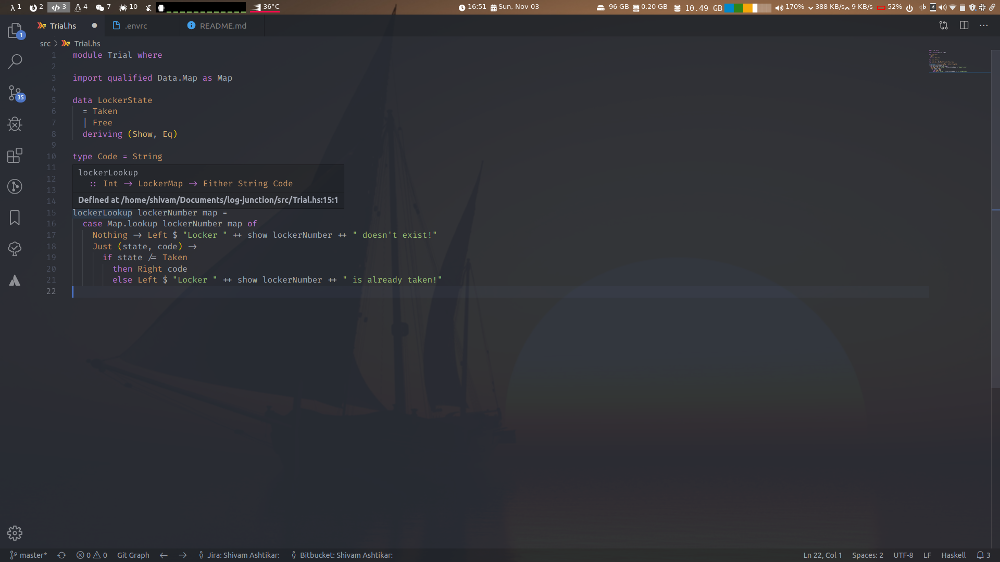
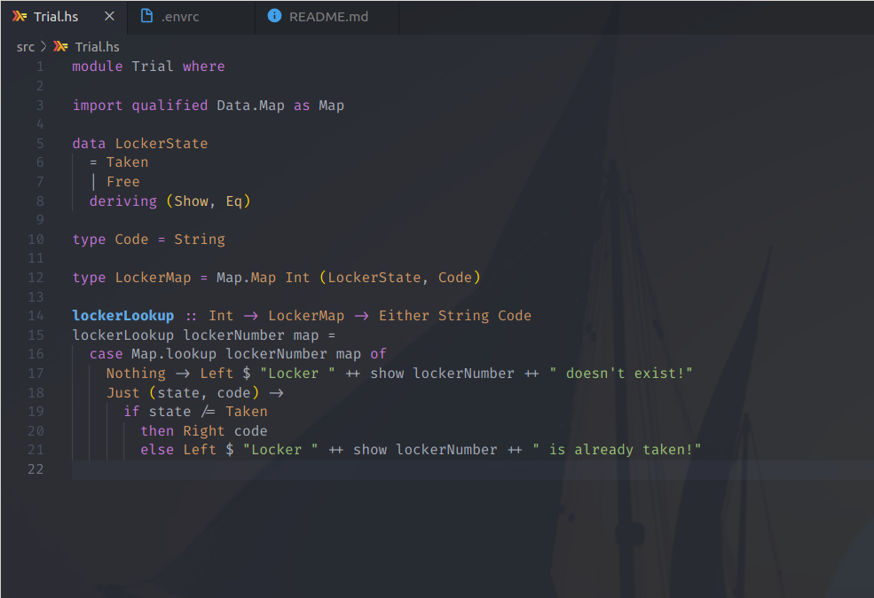

# My Haskell IDE Setup with cabal and nix

An inteligent IDE makes development a child's play. In a strongly typed environment, being able infer `types` while coding makes life haven!

I use `vscode` for most of the development and somtimes `nvim`. Projects I work on are usually build with `nix` + `cabal`, so I needed plugins which will extract the capabilities of `nix` as well.

## Plugins

Follwing are the plugins list for `vscode` for haskell projects.

### [direnv](https://github.com/direnv/direnv#install)

  It let us load and unload environment variables depending on the current directory.
  After installing bot `direnv` executable and vscode plugin, [follow this instructions](https://github.com/direnv/direnv/wiki/Nix) to add `use_nix` function in `~/.direnvrc`. Then under your projects root folder create a `.envrc` file which will only have

  ``` shell
  use_nix -s shell.nix
  ```

  Here is how my [~/.direnvrc](./.direnvrc) looks like. Next time you open your project, vscode will automatically load `nix` environment for you.

### [ghcide](https://github.com/digital-asset/ghcide)

  It provides all the necessary functionality that we need. It displays `type`, `dignostics`, `jump to definition` and `quick fixes` features. After installing [executable](https://github.com/digital-asset/ghcide) and [plugin](https://marketplace.visualstudio.com/items?itemName=DigitalAssetHoldingsLLC.ghcide) you will be able to see type and definition.

### [haskell-linter](https://marketplace.visualstudio.com/items?itemName=hoovercj.haskell-linter)

   It highlights hlint warnings and errors inline and provides a code-action to accept hlint suggestions. You need to install `hlint` for this plugin. You can also add `.hlint.yaml` in your projects root directory.

### [haskell-ghcid](https://marketplace.visualstudio.com/items?itemName=ndmitchell.haskell-ghcid)

  Integrates vscode with [ghcid](https://github.com/ndmitchell/ghcid)

### [Haskell Code Formatter](https://marketplace.visualstudio.com/items?itemName=sergey-kintsel.haskell-formatter-vscode-extension)

  This will help you format your code. Will make more readable and preety.

### [stylish-haskell](https://marketplace.visualstudio.com/items?itemName=vigoo.stylish-haskell)

  Another code formatter for Haskell.

### [Haskell Syntax Highlighting](https://marketplace.visualstudio.com/items?itemName=justusadam.language-haskell)

  Support for the Haskell programming language in visual studio code.

### [TabNine](https://marketplace.visualstudio.com/items?itemName=TabNine.tabnine-vscode)

  It indexes your whole project and provides useful suggestions.

### [hoogel-vscode](https://marketplace.visualstudio.com/items?itemName=jcanero.hoogle-vscode)

  Makes hoogle search easier.

 [Trailing Spaces](https://marketplace.visualstudio.com/items?itemName=shardulm94.trailing-spaces)

  highlight trailing spaces.

## Fonts

### [Fira Code](https://github.com/tonsky/FiraCode)

  Monospaced font with programming ligatures

## Aditional

- If you use `zsh` then you can add this plugin [zsh-nix-shell](https://github.com/chisui/zsh-nix-shell) which will lets you use zsh in nix-shell shell

- Here is my [.nvimrc](./.nvimrc) and [.nvimrc.plug](./.nvimrc.plug) with haskell plugins.

## Screenshots



